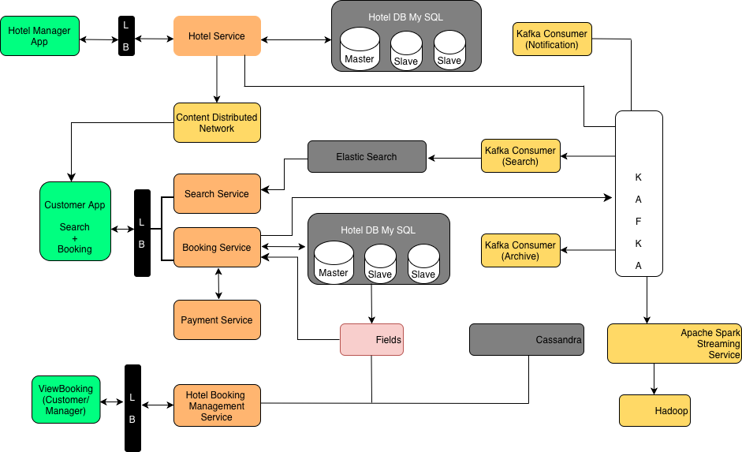

# Requirement-analysis.

# Requirement Analysis in Software Development
The Requirement Analysis Project focuses on crafting a comprehensive foundation for software development by documenting, analyzing, and structuring requirements. Through a series of well-defined tasks, learners will create a detailed blueprint of the requirement analysis phase for a booking management system. This project simulates a real-world development scenario, emphasizing clarity, precision, and structure in defining requirements to set the stage for successful project execution.

# What is Requirement Analysis?
Requirement Analysis is a critical phase in the software development lifecycle (SDLC) where the project team gathers, analyzes, and defines the requirements of the software product to be developed. This process ensures that all stakeholders have a clear and mutual understanding of what the system should do and how it should perform.

# Why is Requirement Analysis Important?
- Clarity and Understanding: It helps in understanding what the stakeholders expect from the software, reducing ambiguity.
- Scope Definition: Clearly defines the scope of the project, which helps in preventing scope creep.
- Basis for Design and Development: Provides a solid foundation for designing and developing the system.

# Key Activities in Requirement Analysis
1. Requirement Gathering 🗂️
- Interviews: Conducting interviews with stakeholders to gather detailed information about their needs and expectations.
- Surveys/Questionnaires: Distributing surveys to collect requirements from a larger audience.
- Workshops: Organizing workshops with stakeholders to discuss and gather requirements.

2. Requirement Elicitation ✍️
- Brainstorming: Conducting brainstorming sessions to generate ideas and gather requirements.
- Focus Groups: Holding focus group discussions with selected stakeholders to gather detailed requirements.
- Prototyping: Creating prototypes to help stakeholders visualize the system and refine their requirements.
  
3. Requirement Documentation 📚
- Requirement Specification Document: Creating a detailed document that lists all functional and non-functional requirements.
- User Stories: Writing user stories to describe functionalities from the user’s perspective.
- Use Cases: Creating use case diagrams to show interactions between users and the system.
  
4. Requirement Analysis and Modeling 📊
- Requirement Prioritization: Prioritizing requirements based on their importance and impact on the project.
- Feasibility Analysis: Assessing the feasibility of requirements in terms of technical, financial, and time constraints.
- Modeling: Creating models (e.g., data flow diagrams, entity-relationship diagrams) to visualize and analyze requirements.
  
5. Requirement Validation ✅
- Review and Approval: Reviewing the documented requirements with stakeholders to ensure accuracy and completeness.
- Acceptance Criteria: Defining clear acceptance criteria for each requirement to ensure they meet the expected standards.
- Traceability: Establishing traceability matrices to ensure all requirements are addressed during development and testing.

# Types of Requirements
1. Functional Requirements ⚙️
Definition: Describe what the system should do.
Examples: Hotel listing Management, Search Functionality, Booking Management 

2. Non-functional Requirements 🛡️
Definition: Describe how the system should perform.
Examples: Performance, security, scalability, usability, reliability.

# Use Case Diagrams
What are Use Case Diagrams?
Use case diagrams show how different users (actors) interact with the system to achieve specific goals (use cases).

# Benefits of Use Case Diagrams
- Provide a clear visual representation of system functionalities.
- Help in identifying and organizing system requirements.
- Facilitate communication among stakeholders and development team.

  # Alx Booking Use Case Diagram
  

# Acceptance Criteria
Importance of Acceptance Criteria
- It ensure all parties have a clear understanding of feature requirements.
- It Provide a basis for testing and validation.
- It helps in maintaining quality and meeting user expectations

Example for Checkout System: Payment options available;Users should be able to select from at least one valid payment method (e.g., credit/debit card, PayPal).

